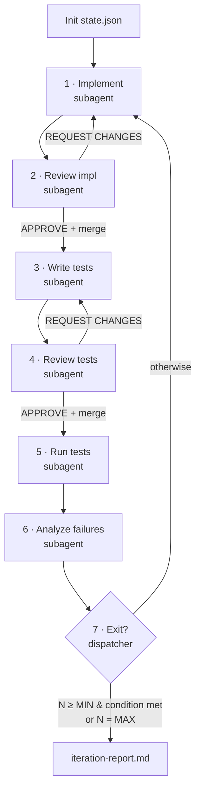
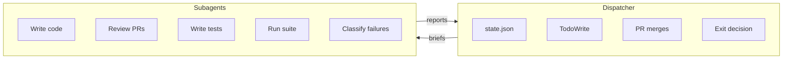

# agent-dispatch-loop

Dispatcher orchestrates subagents through a 7-step build loop until tests pass.

```mermaid
flowchart TD
    S0[Init state.json] --> S1

    S1[1 · Implement\nsubagent] --> S2[2 · Review impl\nsubagent]
    S2 -- REQUEST CHANGES --> S1
    S2 -- APPROVE + merge --> S3

    S3[3 · Write tests\nsubagent] --> S4[4 · Review tests\nsubagent]
    S4 -- REQUEST CHANGES --> S3
    S4 -- APPROVE + merge --> S5

    S5[5 · Run tests\nsubagent] --> S6[6 · Analyze failures\nsubagent]
    S6 --> S7{7 · Exit?\ndispatcher}

    S7 -- "N ≥ MIN & condition met\nor N = MAX" --> OUT[iteration-report.md]
    S7 -- otherwise --> S1
```

```mermaid
flowchart LR
    subgraph Dispatcher
        state[state.json]
        todos[TodoWrite]
        merge[PR merges]
        exit[Exit decision]
    end
    subgraph Subagents
        code[Write code]
        review[Review PRs]
        tests[Write tests]
        run[Run suite]
        analyze[Classify failures]
    end
    Dispatcher -- briefs --> Subagents
    Subagents -- reports --> Dispatcher
```
