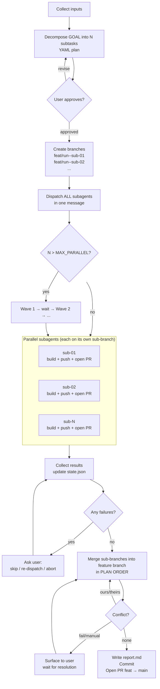
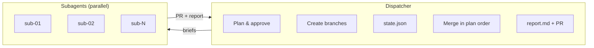

# parallel-subagent-fanout

Decompose a goal into independent subtasks, run them concurrently, merge results into one PR.





## Branch naming

```
main
└── feat/<run_id>          ← feature branch (dispatcher merges here)
    ├── feat/<run_id>--sub-01   ← subagent 1 (double-dash, not slash)
    ├── feat/<run_id>--sub-02
    └── feat/<run_id>--sub-N
```

## Conflict strategies

| `CONFLICT_STRATEGY` | Action |
|---------------------|--------|
| `fail` (default) | Stop, surface to user |
| `ours` | Prefer feature branch side |
| `theirs` | Prefer sub-branch side |
| `manual` | Leave markers, wait for user |
